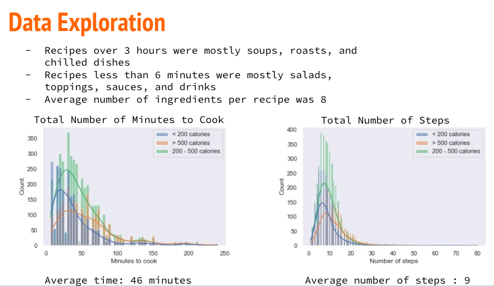
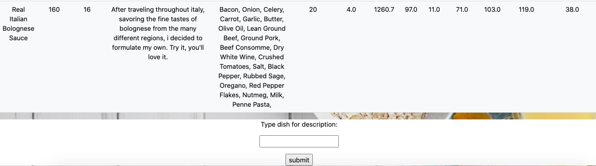

# Recipe Recommender

The motivation for this project comes from my passion for food and cooking. With there being over hundreds of thousands of recipes I wanted to try to solve the issue of not only what I should make next but also what new dishes I might like based on what I have already made.

Due to the time constraints of my project I used the user interactions as well as the user ratings to filter a final dataset of 10,000 recipes. 

# The two recommenders

# The website

## Home Page
I created the website using flask. On the home page there are 4 search bars. The first two search bars are ways to deal with the cold start problems I had. In one search bar you can search for recipes based on the dish themself, like burgers, salads, or pizza. The second search bar allows for searches based on the ingredients in a dish. For example, if you had pasta laying around your house and wanted to find a dish that included pasta it would give you multiple options.

## Ingredient Search Example
I searched pasta as the ingredients, and this is one example of a recipe recommended.

## Nutrition recommender
The first recommender, mentioned above, is the nutrition recommender. This one allows you to search the name of a recipe you enjoyed making and get recommended recipes with similar nutritional features. Those nutritional features included calories, total fat, sodium, protein, saturated fat, and carbohydrates.

## Recipe content recommender
Similarly, we can search the name of the dish we enjoy in the second recommender and now get different dishes recommended based on the recipe themselves. As a refresher, SBERT took the words of the recipe and turned them into numbers. These number vectors were than compared to one another in a cosine similarity function. The end result was a number between -1 and 1. Negative numbers would indicate a big difference in the recipes and the number closest to one were the most similar. 

After getting the description of the new recipe you can than continue the cycle of recommendations.

# Future Steps

