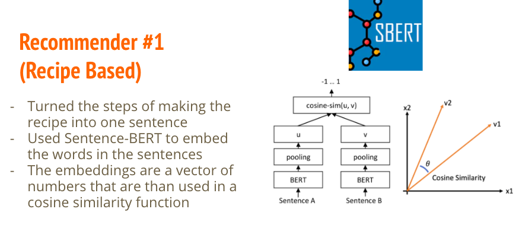
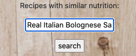
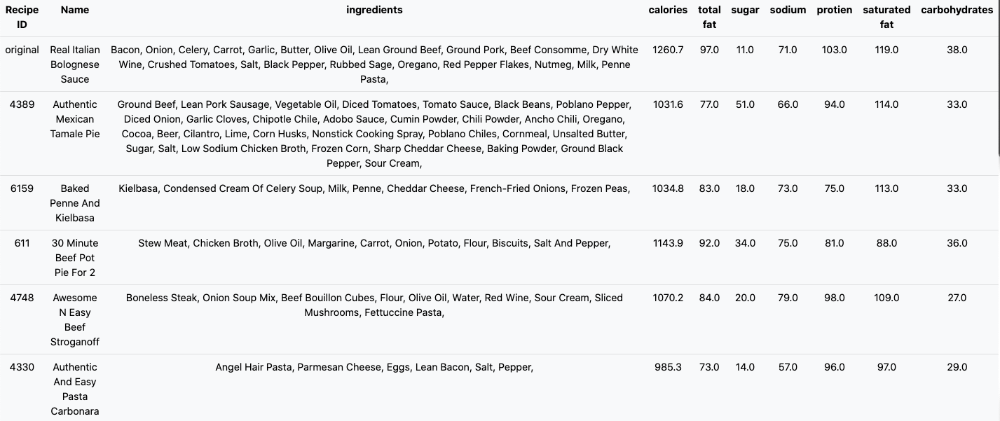
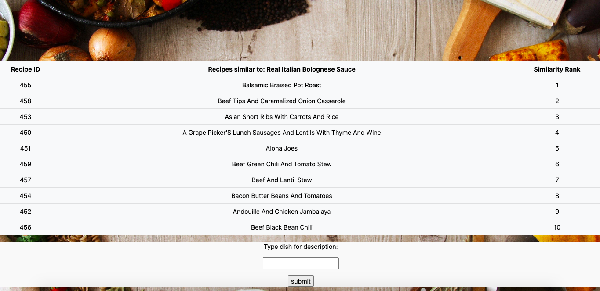
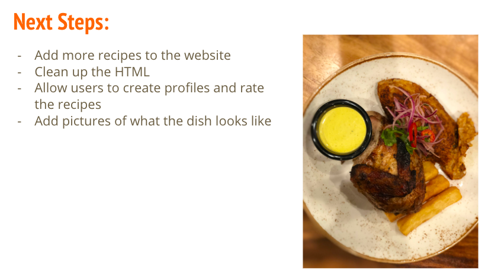

# Recipe Recommender

The motivation for this project comes from my passion for food and cooking. With there being over hundreds of thousands of recipes I wanted to try to solve the issue of not only what I should make next but also what new dishes I might like based on what I have already made.

Due to the time contraints of my project I used the user interactions as well as the user ratings to filter a final dataset of 10,000 recipes. 

# The two recommenders

# The website

## Home Page

## Ingredient search example

## Nutrition recommender

## Recipe content recommender

# Future Steps

